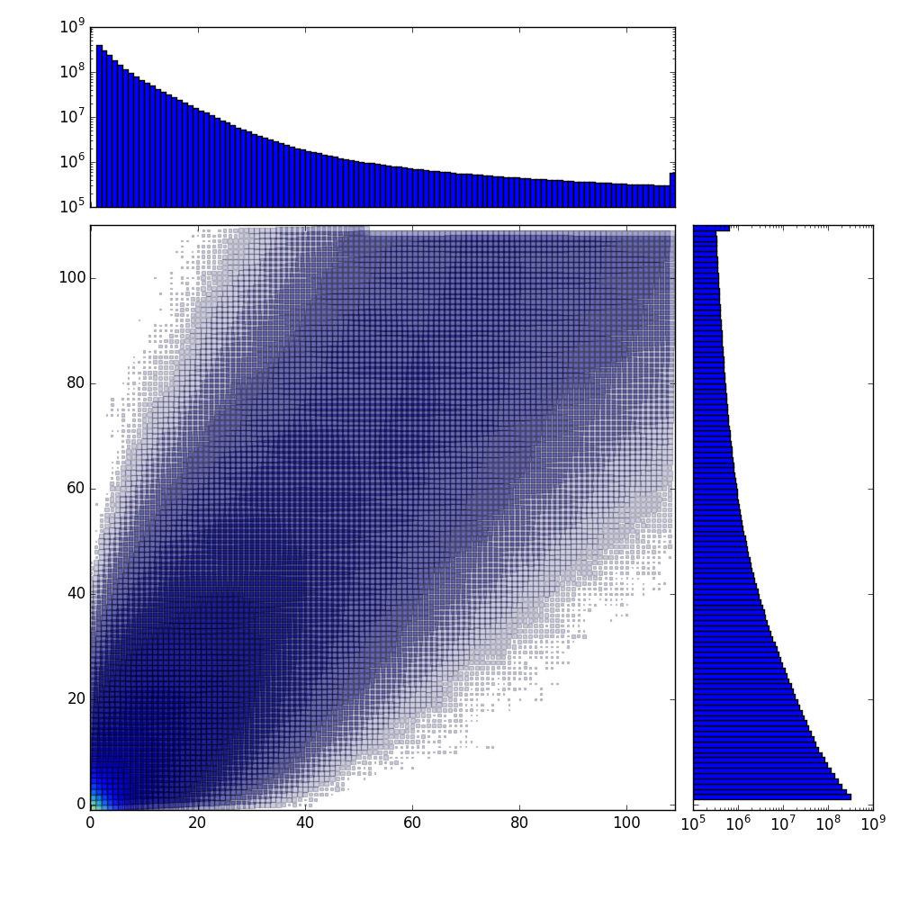

# pageant
PAltry GEnomic ANalysis Tools

Currently: one tool, [`ReadDepthHistogram`](https://github.com/hammerlab/pageant/blob/master/src/main/scala/org/hammerlab/pageant/ReadDepthHistogram.scala), for analyzing coverage in a BAM file or files.

Example usage:

```
$ ADDL_JARS=target/pageant-with-dependencies-1.0-SNAPSHOT.jar adam-shell [optional: Spark args for running on cluster]
scala> import org.hammerlab.pageant.ReadDepthHistogram

// Create a joint histogram over two BAMs
scala> val h = ReadDepthHistogram.run2(sc, "sample1.bam", "sample2.bam")
…
h: org.hammerlab.pageant.ReadDepthHistogram.Histogram2 = Histogram2(reads1 MapPartitionsRDD[1] at map at ADAMContext.scala:172,reads2 MapPartitionsRDD[3] at map at ADAMContext.scala:172)

// Print the number of loci where the first BAM's coverage differs from the second BAM's by N, for N ≤ 10.
scala> println(h.absDiffs.takeOrdered(10).mkString("\n"))
…
(0,199636289)
(1,566930813)
(2,404021882)
(3,292680434)
(4,215189098)
(5,159051616)
(6,119161243)
(7,90198385)
(8,69164989)
(9,53688557)
```

Exporting the generated RDDs to `.csv`s and plotting using `plots.py`:

```
scala> import org.hammerlab.pageant.Histogram
scala> Histogram.make(h.readDepthHist1).writeCsv("h1.csv")
scala> Histogram.make(h.readDepthHist2).writeCsv("h2.csv")
scala> h.lociCountsByMaxDepth.map(p => List(p._1._1,p._1._2,p._2).mkString(",")).coalesce(1).saveAsTextFile('depths-by-max.csv')

// Triplets of (BAM 1 coverage, BAM 2 coverage, number of loci with those coverages).
// Note that the (0,0,…) triple is missing because I am not yet joining against a full reference genome
// to back out the number of loci that the two BAMs have equal coverage at.
$ head depths-by-max.csv
0,1,103590535
1,0,147344585
1,1,66986311
0,2,65245776
1,2,48124776
2,0,89836297
2,1,48575462
2,2,37946416
0,3,43358095
1,3,35372665

$ python plots.py
```


