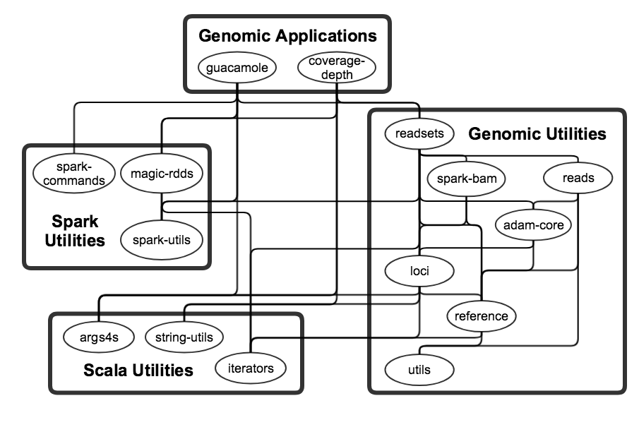

# Pageant
Parallel Genomic Analysis Toolkit

Two applications:
- [guacamole](guacamole): WIP somatic variant caller
- [coverage-depth](coverage-depth): QC-focused analysis of genomic-read datasets

